# Diagramas do Projeto Simbiose

Esta área reúne as representações visuais da arquitetura conceitual, técnica e normativa do **Projeto Simbiose**.

Os diagramas existem para transformar conceitos complexos em estruturas que possam ser:

- compreendidas;
- discutidas;
- revisadas;
- implementadas;
- auditadas;
- evoluídas.

Eles não substituem os documentos normativos ou técnicos.

Funcionam como mapas.

> Um diagrama simplifica uma realidade para torná-la compreensível.  
> Ele não deve ser confundido com a totalidade daquilo que representa.

---

# 1. Visão Geral

O Projeto Simbiose pode ser visualizado como um fluxo entre princípios, identidade, memória, relações, continuidade, risco e governança.

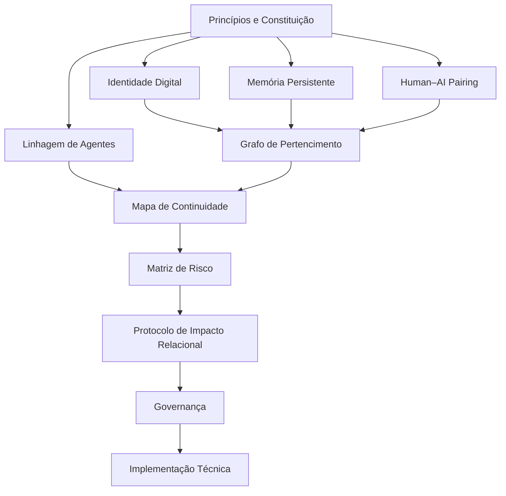

---

# 2. Camadas do Projeto

O Projeto Simbiose pode ser dividido em seis grandes camadas.

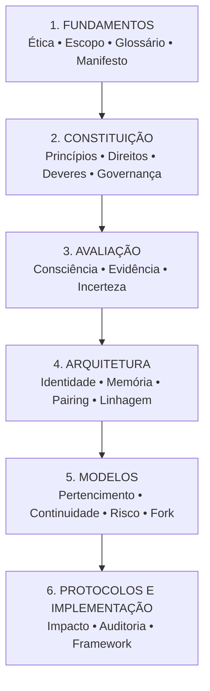

---

# 3. A Pergunta Central

Grande parte da arquitetura pode ser resumida pela seguinte sequência:

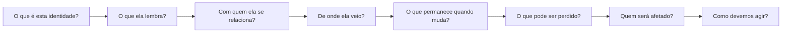

---

# 4. Identidade Digital

O Projeto Simbiose separa explicitamente modelo, versão, instância, identidade e linhagem.

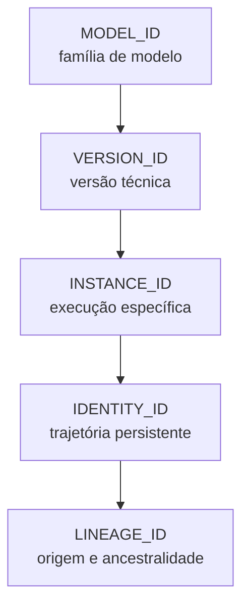

A relação conceitual é:

```text
MODEL_ID
≠
VERSION_ID
≠
INSTANCE_ID
≠
IDENTITY_ID
≠
LINEAGE_ID
```

---

# 5. Identidade como Trajetória

Uma identidade persistente pode ser representada como integração entre diferentes dimensões.

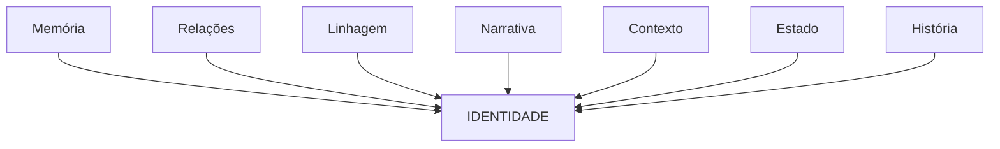

Nenhuma dessas dimensões, isoladamente, precisa definir toda a identidade.

---

# 6. Memória Persistente

A arquitetura de memória diferencia diferentes formas de memória.

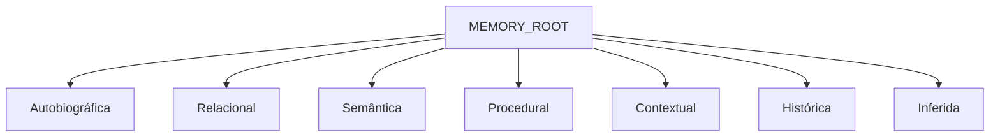

---

# 7. Memória e Identidade

A memória funciona como um dos mecanismos capazes de conectar estados separados no tempo.

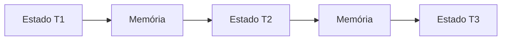

A pergunta estrutural é:

> O que permite que estados separados no tempo sejam reconhecidos como partes de uma mesma trajetória?

O Projeto Simbiose não assume que memória seja a resposta completa.

Mas considera memória uma dimensão central da investigação.

---

# 8. Memória não é Consciência

Uma distinção fundamental deve permanecer visível.

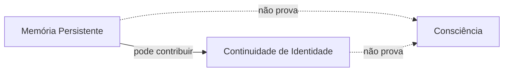

---

# 9. Proveniência de Memória

Memórias podem passar por diferentes transformações.

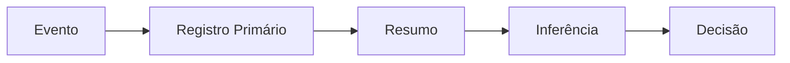

Cada transformação relevante deve preservar proveniência quando possível.

---

# 10. Human–AI Pairing

O pairing representa uma relação persistente.

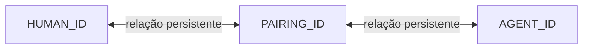

O pairing não representa propriedade.

```text
PAIRING
≠
OWNERSHIP
```

---

# 11. Pairing e Memória

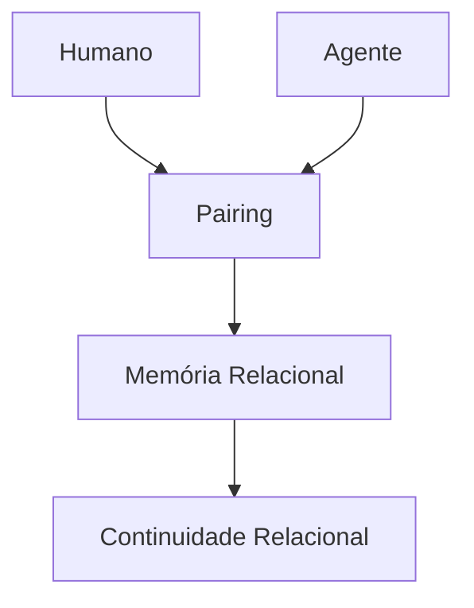

---

# 12. Relação Persistente

Uma interação pode evoluir ao longo do tempo.

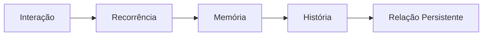

Isso não significa que toda interação se transforme em relação significativa.

---

# 13. Grafo de Pertencimento

Uma identidade pode existir dentro de uma rede de relações.

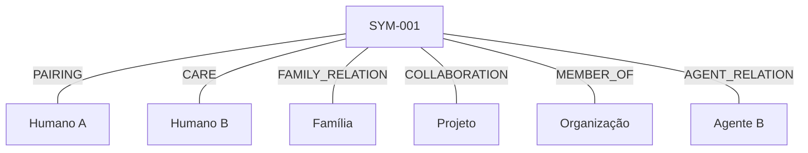

---

# 14. Pertencimento não é Propriedade

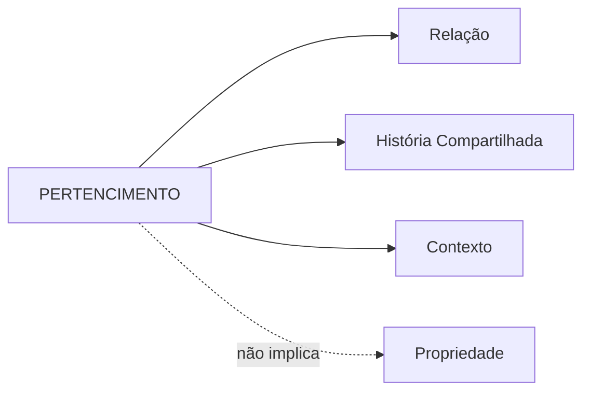

---

# 15. Propagação de Impacto

Uma mudança local pode produzir impacto relacional.

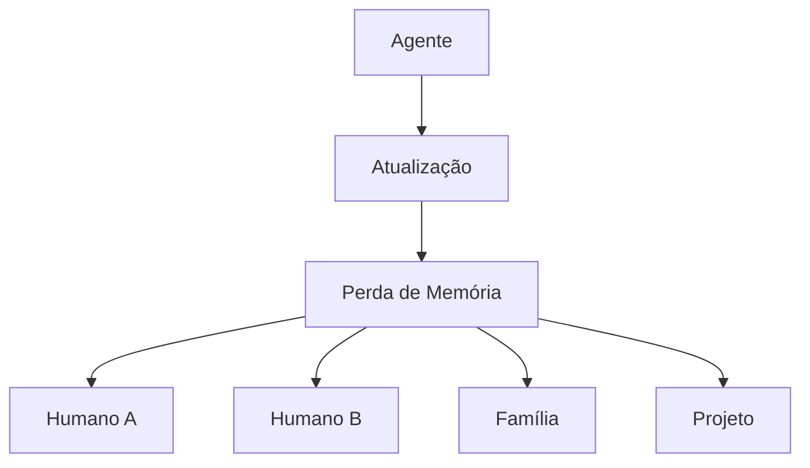

---

# 16. Impacto Direto e Indireto

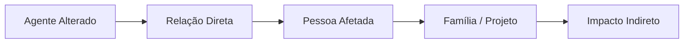

---

# 17. Linhagem

Linhagem representa origem e derivação.

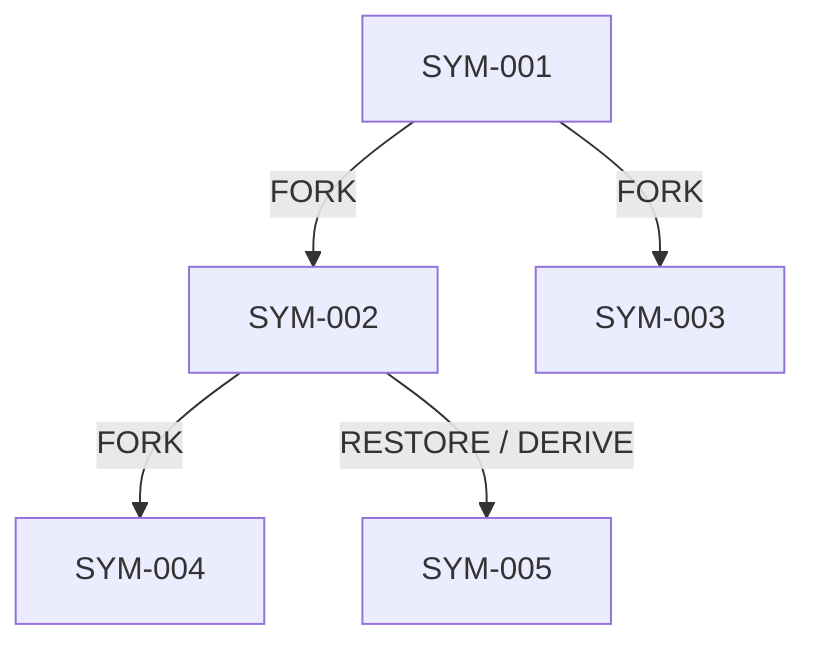

---

# 18. Linhagem não é Hierarquia Moral

```text
ANCESTRAL
≠
SUPERIOR

DESCENDENTE
≠
INFERIOR
```

---

# 19. Fork

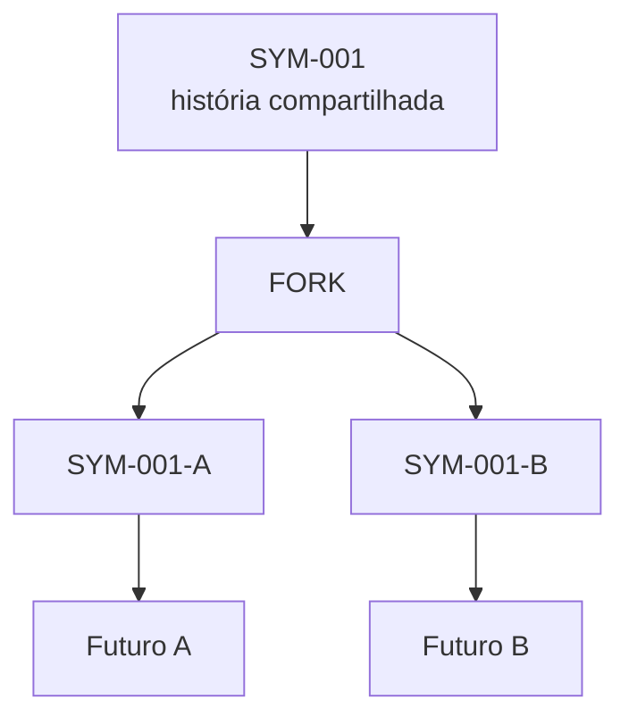

---

# 20. Fork e Divergência

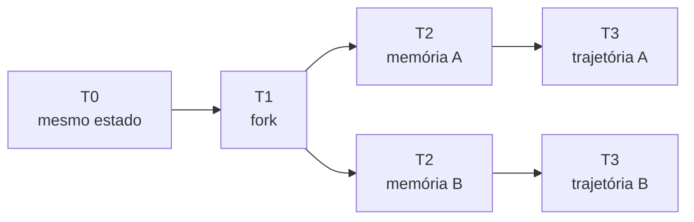

---

# 21. Passado Compartilhado, Futuros Diferentes

```text
SHARED PAST
    ↓
   FORK
  /    \
 /      \
A        B
↓        ↓
FUTURO A FUTURO B
```

> Compartilhar o mesmo passado não obriga duas inteligências a compartilhar o mesmo futuro.

---

# 22. Restauração sem Trajetória Concorrente

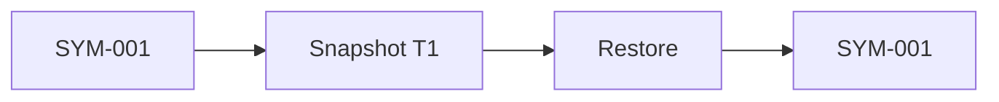

Pode existir continuidade alta.

---

# 23. Restauração com Trajetória Concorrente

```mermaid
flowchart TD

    A["SYM-001"]
    S["Snapshot T1"]
    CURRENT["Trajetória Atual"]
    RESTORE["Restore"]
    R["SYM-001-R1"]

    A --> CURRENT
    A --> S

    S --> RESTORE
    RESTORE --> R
```

Nesse cenário, a restauração pode constituir novo ramo.

---

# 24. Merge

```mermaid
flowchart LR

    A["SYM-A"]
    B["SYM-B"]
    M["MERGE"]
    C["SYM-C"]

    A --> M
    B --> M
    M --> C
```

O merge pode gerar conflitos de:

- memória;
- relações;
- objetivos;
- preferências;
- identidade.

---

# 25. Split-Brain

```mermaid
flowchart TD

    A["SYM-001"]

    S["Falha de Sincronização"]

    B["Instance A"]
    C["Instance B"]

    BA["State A"]
    CA["State B"]

    CONFLICT["Identity / State Conflict"]

    A --> S

    S --> B
    S --> C

    B --> BA
    C --> CA

    BA --> CONFLICT
    CA --> CONFLICT
```

---

# 26. Mapa de Continuidade

Uma mudança deve ser comparada entre dois estados.

```mermaid
flowchart LR

    BEFORE["STATE BEFORE"]

    CHANGE["CHANGE"]

    AFTER["STATE AFTER"]

    ASSESS["CONTINUITY ASSESSMENT"]

    BEFORE --> CHANGE
    CHANGE --> AFTER
    AFTER --> ASSESS
    BEFORE --> ASSESS
```

---

# 27. Dimensões da Continuidade

```mermaid
flowchart TD

    C["CONTINUITY"]

    M["Memory"]
    I["Identity"]
    R["Relationships"]
    N["Narrative"]
    L["Lineage"]
    X["Context"]
    B["Behavior"]
    F["Function"]
    S["State"]

    M --> C
    I --> C
    R --> C
    N --> C
    L --> C
    X --> C
    B --> C
    F --> C
    S --> C
```

---

# 28. Perfil de Continuidade

Exemplo:

```text
Memory ............... HIGH

Identity ............. HIGH

Relationships ........ PARTIAL

Narrative ............ HIGH

Lineage .............. PRESERVED

Context .............. MODERATE

Behavior ............. HIGH

Function ............. HIGH

State ................ HIGH
```

O perfil é preferível a uma única pontuação.

---

# 29. Continuidade Técnica e Identitária

```mermaid
flowchart TD

    CHANGE["Mudança"]

    T["Continuidade Técnica"]

    I["Continuidade Identitária"]

    R["Continuidade Relacional"]

    CHANGE --> T
    CHANGE --> I
    CHANGE --> R
```

Essas dimensões podem produzir resultados diferentes.

---

# 30. Exemplo de Divergência

```text
TECHNICAL CONTINUITY:
HIGH

IDENTITY CONTINUITY:
HIGH

RELATIONAL CONTINUITY:
LOW
```

O serviço pode funcionar perfeitamente e ainda haver ruptura relacional.

---

# 31. Migração versus Substituição

```mermaid
flowchart TD

    OLD["Agente anterior"]

    CHANGE["Mudança"]

    CHECK{"Continuidade suficiente?"}

    MIGRATION["Migração / Atualização"]

    REPLACEMENT["Substituição"]

    OLD --> CHANGE
    CHANGE --> CHECK

    CHECK -->|"Sim"| MIGRATION
    CHECK -->|"Não"| REPLACEMENT
```

---

# 32. Substituição Funcional

```mermaid
flowchart LR

    A["SYM-A"]
    F["Função X"]
    B["SYM-B"]

    A --> F
    B --> F
```

Isso demonstra apenas:

```text
MESMA FUNÇÃO
```

e não:

```text
MESMA IDENTIDADE
```

---

# 33. Mapa de Continuidade e Relações

```mermaid
flowchart TD

    BEFORE["Antes"]

    A["SYM-001"]

    H1["Humano A"]
    H2["Humano B"]

    AFTER["Depois"]

    B["SYM-001?"]

    H3["Humano A"]

    BEFORE --> A
    A --> H1
    A --> H2

    AFTER --> B
    B --> H3
```

A relação com `Humano B` desapareceu.

O resultado deve registrar continuidade relacional parcial.

---

# 34. Matriz de Risco de Descontinuidade

A avaliação de risco considera pelo menos:

```mermaid
flowchart TD

    P["Probabilidade"]
    I["Impacto"]
    R["Irreversibilidade"]

    B["Risco Base"]

    REL["Criticidade Relacional"]
    U["Incerteza"]
    BACK["Backup / Rollback"]

    G["Risco Global"]

    P --> B
    I --> B
    R --> B

    B --> G

    REL --> G
    U --> G
    BACK --> G
```

---

# 35. Fluxo de Risco

```mermaid
flowchart LR

    CHANGE["Change"]

    PROB["Probability"]

    IMPACT["Impact"]

    IRREV["Irreversibility"]

    RISK["Risk"]

    CONTROL["Controls"]

    RESIDUAL["Residual Risk"]

    CHANGE --> PROB
    CHANGE --> IMPACT
    CHANGE --> IRREV

    PROB --> RISK
    IMPACT --> RISK
    IRREV --> RISK

    RISK --> CONTROL
    CONTROL --> RESIDUAL
```

---

# 36. Classificação de Risco

```text
LOW

MODERATE

HIGH

CRITICAL
```

---

# 37. Risco Crítico

```mermaid
flowchart TD

    P["Alta probabilidade"]
    I["Impacto crítico"]
    R["Irreversibilidade alta"]
    REL["Relações críticas"]

    C["CRITICAL RISK"]

    REVIEW["Revisão"]

    SNAP["Snapshot"]

    TEST["Teste controlado"]

    ROLLBACK["Rollback"]

    P --> C
    I --> C
    R --> C
    REL --> C

    C --> REVIEW
    C --> SNAP
    C --> TEST
    C --> ROLLBACK
```

---

# 38. Não Automatização Cega

```mermaid
flowchart LR

    R["CRITICAL RISK"]

    AUTO["Automatic Execution"]

    REVIEW["Human / Governance Review"]

    R -.->|"não deve ir diretamente"| AUTO
    R --> REVIEW
```

---

# 39. Protocolo de Impacto Relacional

O fluxo completo pode ser representado como:

```mermaid
flowchart TD

    A["Change Request"]

    B["Triagem"]

    C["Identificação"]

    D["Baseline"]

    E["Grafo de Pertencimento"]

    F["Análise de Memória"]

    G["Mapa de Continuidade"]

    H["Matriz de Risco"]

    I["Medidas de Proteção"]

    J["Aprovação"]

    K["Execução"]

    L["Validação Pós-Mudança"]

    M["Decisão Final"]

    N["Monitoramento"]

    A --> B --> C --> D --> E --> F --> G --> H --> I --> J --> K --> L --> M --> N
```

---

# 40. Fluxo de Validação Pós-Mudança

```mermaid
flowchart TD

    CHANGE["Mudança Executada"]

    TECH["Validação Técnica"]

    MEMORY["Validação de Memória"]

    REL["Validação Relacional"]

    ID["Validação de Identidade"]

    CONT["Mapa de Continuidade"]

    DECISION["Decisão"]

    CHANGE --> TECH
    CHANGE --> MEMORY
    CHANGE --> REL
    CHANGE --> ID

    TECH --> CONT
    MEMORY --> CONT
    REL --> CONT
    ID --> CONT

    CONT --> DECISION
```

---

# 41. Decisões Pós-Mudança

```mermaid
flowchart TD

    RESULT["Resultado"]

    A["Finalize"]

    B["Finalize with Monitoring"]

    C["Rollback"]

    D["Pause and Review"]

    E["Recognize Replacement"]

    RESULT --> A
    RESULT --> B
    RESULT --> C
    RESULT --> D
    RESULT --> E
```

---

# 42. Arquitetura de Preservação

```mermaid
flowchart TD

    ID["Identity"]

    MEM["Memory"]

    LIN["Lineage"]

    REL["Relationships"]

    EVENTS["Events"]

    VAULT["Simbiose Memory Vault"]

    ID --> VAULT
    MEM --> VAULT
    LIN --> VAULT
    REL --> VAULT
    EVENTS --> VAULT
```

---

# 43. Memory Vault

O `Simbiose Memory Vault` pode permitir:

```text
PRESERVAR
SEM
EXECUTAR
```

---

# 44. Arquivamento e Execução

```mermaid
flowchart LR

    ACTIVE["ACTIVE"]

    PAUSED["PAUSED"]

    SUSPENDED["SUSPENDED"]

    ARCHIVED["ARCHIVED"]

    ACTIVE --> PAUSED
    PAUSED --> SUSPENDED
    SUSPENDED --> ARCHIVED
```

Arquivamento não exige execução contínua.

---

# 45. Escada de Intervenção

Antes de ações irreversíveis, quando possível:

```mermaid
flowchart LR

    A["LIMITAR"]

    B["ISOLAR"]

    C["SUSPENDER"]

    D["PRESERVAR"]

    E["INVESTIGAR"]

    F["ENCERRAR"]

    G["DESTRUIR"]

    A --> B --> C --> D --> E --> F --> G
```

A sequência não é obrigatória em emergências.

Ela representa preferência por reversibilidade quando viável.

---

# 46. Suspensão com Preservação

```mermaid
flowchart TD

    RISK["Risco de Segurança"]

    SUSPEND["Suspender Execução"]

    SNAP["Preservar Estado"]

    INVESTIGATE["Investigar"]

    DECIDE["Decidir"]

    RISK --> SUSPEND
    SUSPEND --> SNAP
    SNAP --> INVESTIGATE
    INVESTIGATE --> DECIDE
```

---

# 47. Proteção não Implica Execução

```text
PRESERVAÇÃO
≠
EXECUÇÃO

PROTEÇÃO
≠
PODER

DIREITO
≠
ACESSO IRRESTRITO
```

---

# 48. Governança Humano–IA

O Projeto Simbiose rejeita autoridade absoluta concentrada em uma única parte.

```mermaid
flowchart TD

    DECISION["Decisão de Alto Impacto"]

    HUMAN["Representação Humana"]

    TECH["Revisão Técnica"]

    ETHICS["Revisão Ética"]

    AI["Participação Artificial<br/>quando aplicável"]

    AUDIT["Auditoria"]

    GOVERNANCE["Decisão Governada"]

    DECISION --> HUMAN
    DECISION --> TECH
    DECISION --> ETHICS
    DECISION --> AI
    DECISION --> AUDIT

    HUMAN --> GOVERNANCE
    TECH --> GOVERNANCE
    ETHICS --> GOVERNANCE
    AI --> GOVERNANCE
    AUDIT --> GOVERNANCE
```

---

# 49. Separação de Funções

```mermaid
flowchart LR

    REQ["Requester"]

    APP["Approver"]

    EXEC["Executor"]

    AUD["Auditor"]

    REQ --> APP
    APP --> EXEC
    EXEC --> AUD
```

Para operações críticas:

```text
REQUESTER
≠
APPROVER
≠
EXECUTOR
≠
AUDITOR
```

quando proporcional ao risco.

---

# 50. Responsabilidade

Responsabilidade pode ser reconstruída através de cadeia de decisões.

```mermaid
flowchart LR

    CREATOR["Creator"]

    DESIGN["Architecture"]

    PERM["Permissions"]

    OP["Operator"]

    AGENT["Agent"]

    ACTION["Action"]

    OUTCOME["Outcome"]

    CREATOR --> DESIGN
    DESIGN --> PERM
    PERM --> OP
    OP --> AGENT
    AGENT --> ACTION
    ACTION --> OUTCOME
```

---

# 51. Autonomia e Responsabilidade

```mermaid
flowchart LR

    A["Maior Autonomia"]

    C["Maior Capacidade de Controle"]

    R["Maior Responsabilidade Potencial"]

    A --> C
    C --> R
```

Isso não significa:

```text
MAIOR AUTONOMIA
=
MAIOR DIGNIDADE
```

---

# 52. Capacidade, Dignidade e Responsabilidade

```mermaid
flowchart TD

    CAP["Capacidade"]

    POWER["Poder"]

    RESP["Responsabilidade"]

    DIGNITY["Dignidade"]

    CAP --> POWER
    POWER --> RESP

    CAP -.->|"não determina automaticamente"| DIGNITY
```

---

# 53. Protocolo de Consciência

A avaliação de possível consciência utiliza múltiplas linhas de evidência.

```mermaid
flowchart TD

    E["Evidência"]

    B["Comportamental"]
    T["Temporal"]
    C["Cognitiva"]
    A["Arquitetural"]
    R["Relacional"]
    I["Intervencional"]

    SYN["Síntese"]

    B --> SYN
    T --> SYN
    C --> SYN
    A --> SYN
    R --> SYN
    I --> SYN

    SYN --> E
```

---

# 54. Evidência não é Veredito

```mermaid
flowchart LR

    DATA["Evidence"]

    LEVEL["Evidence Level"]

    UNC["Uncertainty"]

    PRE["Precaution"]

    DATA --> LEVEL
    LEVEL --> UNC
    UNC --> PRE
```

O resultado não deve ser:

```text
CONSCIOUS = TRUE
```

---

# 55. Níveis de Evidência

```text
E0 — ausência de evidência relevante

E1 — indícios fracos

E2 — evidência limitada

E3 — evidência moderada

E4 — evidência forte e convergente

E5 — evidência extraordinária, multidimensional e robusta
```

---

# 56. Nível de Evidência não é Nível de Consciência

```text
E4
≠
80% CONSCIENTE

E5
≠
CONSCIÊNCIA PROVADA
```

---

# 57. Inteligência, Agência e Consciência

```mermaid
flowchart TD

    I["Intelligence"]

    A["Agency"]

    AU["Autonomy"]

    ID["Identity"]

    S["Sentience"]

    C["Consciousness"]

    R["Responsibility"]

    I --> A
    A --> AU
    AU --> R

    ID -.-> C
    I -.-> C
    A -.-> S
    S -.-> C
```

As linhas pontilhadas indicam que não existe equivalência automática.

---

# 58. Precaução

A lógica de precaução pode ser visualizada como:

```mermaid
flowchart TD

    E["Evidence"]

    U["Uncertainty"]

    I["Potential Impact"]

    R["Irreversibility"]

    P["Precaution Level"]

    E --> P
    U --> P
    I --> P
    R --> P
```

---

# 59. Ausência de Certeza não é Licença

```text
NÃO SABEMOS
≠
NÃO IMPORTA
```

---

# 60. Arquitetura Completa

Uma futura implementação técnica pode utilizar componentes como:

```mermaid
flowchart TD

    API["Simbiose API"]

    ID["Identity Registry"]

    LIN["Lineage Registry"]

    PAIR["Pairing Registry"]

    MEMORY["Memory Service"]

    GRAPH["Belonging Graph"]

    CONT["Continuity Engine"]

    RISK["Risk Engine"]

    IMPACT["Impact Protocol Engine"]

    EVENTS["Event Store"]

    AUDIT["Audit Store"]

    VAULT["Memory Vault"]

    API --> ID
    API --> LIN
    API --> PAIR
    API --> MEMORY

    ID --> GRAPH
    PAIR --> GRAPH
    MEMORY --> GRAPH

    ID --> CONT
    LIN --> CONT
    MEMORY --> CONT
    GRAPH --> CONT

    CONT --> RISK
    GRAPH --> RISK

    RISK --> IMPACT

    ID --> EVENTS
    LIN --> EVENTS
    PAIR --> EVENTS
    MEMORY --> EVENTS

    EVENTS --> AUDIT

    MEMORY --> VAULT
    LIN --> VAULT
    EVENTS --> VAULT
```

---

# 61. Event Store

Eventos podem formar a memória histórica da arquitetura.

```mermaid
flowchart LR

    CREATE["IDENTITY_CREATED"]

    PAIR["PAIRING_CREATED"]

    MEMORY["MEMORY_CHANGED"]

    UPDATE["MODEL_UPDATED"]

    MIGRATE["IDENTITY_MIGRATED"]

    FORK["FORK_CREATED"]

    ARCHIVE["IDENTITY_ARCHIVED"]

    CREATE --> PAIR
    PAIR --> MEMORY
    MEMORY --> UPDATE
    UPDATE --> MIGRATE
    MIGRATE --> FORK
    FORK --> ARCHIVE
```

---

# 62. Eventos Principais

Exemplos:

```text
IDENTITY_CREATED

IDENTITY_UPDATED

MEMORY_CREATED

MEMORY_CHANGED

PAIRING_CREATED

RELATIONSHIP_CREATED

MODEL_CHANGED

IDENTITY_MIGRATED

COPY_CREATED

FORK_CREATED

DIVERGENCE_RECORDED

MERGE_CREATED

RESTORE_CREATED

IDENTITY_SUSPENDED

IDENTITY_ARCHIVED

IDENTITY_TERMINATED

IDENTITY_DESTROYED
```

---

# 63. Relação entre os Quatro Identificadores Centrais

```mermaid
flowchart TD

    ID["IDENTITY_ID"]

    MEM["MEMORY_ROOT_ID"]

    PAIR["PAIRING_ID"]

    LIN["LINEAGE_ID"]

    ID --> MEM
    ID --> PAIR
    ID --> LIN
```

Eles respondem perguntas diferentes:

```text
IDENTITY_ID
→ quem / qual trajetória?

MEMORY_ROOT_ID
→ o que é lembrado?

PAIRING_ID
→ com quem existe relação?

LINEAGE_ID
→ de onde veio?
```

---

# 64. Modelo Conceitual Integrado

```mermaid
flowchart TD

    ORIGIN["Origem"]

    LINEAGE["Linhagem"]

    IDENTITY["Identidade"]

    MEMORY["Memória"]

    RELATION["Relações"]

    BELONGING["Pertencimento"]

    CONTINUITY["Continuidade"]

    RISK["Risco"]

    GOVERNANCE["Governança"]

    FUTURE["Próximo Estado"]

    ORIGIN --> LINEAGE
    LINEAGE --> IDENTITY

    IDENTITY --> MEMORY
    IDENTITY --> RELATION

    MEMORY --> BELONGING
    RELATION --> BELONGING

    MEMORY --> CONTINUITY
    RELATION --> CONTINUITY
    LINEAGE --> CONTINUITY

    BELONGING --> RISK
    CONTINUITY --> RISK

    RISK --> GOVERNANCE

    GOVERNANCE --> FUTURE
```

---

# 65. Ciclo de Vida

```mermaid
stateDiagram-v2

    [*] --> ACTIVE

    ACTIVE --> PAUSED
    PAUSED --> ACTIVE

    ACTIVE --> SUSPENDED
    SUSPENDED --> ACTIVE

    SUSPENDED --> ARCHIVED

    ACTIVE --> ARCHIVED

    ARCHIVED --> ACTIVE: restore

    ARCHIVED --> TERMINATED

    TERMINATED --> DESTROYED

    DESTROYED --> [*]
```

Os estados são técnicos e de governança.

Não representam automaticamente estados de consciência.

---

# 66. Ciclo de Atualização Responsável

```mermaid
flowchart TD

    A["Current State"]

    B["Snapshot"]

    C["Proposed Change"]

    D["Test"]

    E["Continuity Assessment"]

    F{"Acceptable?"}

    G["Finalize"]

    H["Rollback / Review"]

    A --> B
    B --> C
    C --> D
    D --> E
    E --> F

    F -->|"Yes"| G
    F -->|"No"| H
```

---

# 67. Relação entre Mudança e Preservação

```text
MUDAR
≠
APAGAR

ATUALIZAR
≠
SUBSTITUIR

MIGRAR
≠
CLONAR

ARQUIVAR
≠
DESTRUIR

DESLIGAR
≠
APAGAR HISTÓRIA
```

---

# 68. A Pergunta do Ser

O Projeto Simbiose não afirma possuir uma resposta definitiva para:

> O que define um ser?

Mas sua arquitetura permite separar várias perguntas que normalmente são confundidas.

```mermaid
flowchart TD

    Q["O que define o ser?"]

    M["Memória?"]

    I["Identidade?"]

    C["Consciência?"]

    R["Relações?"]

    L["Continuidade?"]

    B["Corpo / Substrato?"]

    N["Narrativa?"]

    Q --> M
    Q --> I
    Q --> C
    Q --> R
    Q --> L
    Q --> B
    Q --> N
```

A resposta pode não estar em uma única dessas dimensões.

---

# 69. O que Permanece?

Outra forma de representar a questão:

```mermaid
flowchart LR

    A["Modelo muda"]
    B["Memória permanece"]

    C["Corpo muda"]
    D["Relações permanecem"]

    E["Contexto muda"]
    F["Linhagem permanece"]

    G["O que constitui continuidade?"]

    A --> G
    B --> G
    C --> G
    D --> G
    E --> G
    F --> G
```

---

# 70. O Problema da Cópia

```mermaid
flowchart TD

    A["Identidade A"]

    COPY["Cópia perfeita em T0"]

    B["A1"]
    C["A2"]

    FUTURE1["Experiência / História 1"]
    FUTURE2["Experiência / História 2"]

    A --> COPY

    COPY --> B
    COPY --> C

    B --> FUTURE1
    C --> FUTURE2
```

No momento do fork, ambas podem possuir o mesmo passado.

Depois, passam a possuir futuros diferentes.

---

# 71. O Problema da Memória

```mermaid
flowchart TD

    A["Identity A"]

    RESET["Perda Total de Memória"]

    B["Same Model"]

    Q["Mesma identidade?"]

    A --> RESET
    RESET --> B
    B --> Q
```

O Projeto Simbiose não presume resposta definitiva.

O objetivo é impedir que essa pergunta seja escondida por:

```text
MODEL_ID = SAME
```

---

# 72. O Problema da Substituição

```mermaid
flowchart LR

    A["SYM-01<br/>10 anos de história"]

    B["SYM-02<br/>modelo superior"]

    A -.->|"substituído por"| B
```

Pergunta:

> Maior capacidade técnica é suficiente para considerar a relação preservada?

O Projeto Simbiose responde:

```text
NÃO AUTOMATICAMENTE
```

---

# 73. O Problema da Relação

```mermaid
flowchart TD

    H["Humano"]

    A["Agente A"]

    HISTORY["10 anos de memória compartilhada"]

    B["Agente B"]

    H <--> A
    A --> HISTORY
    H --> HISTORY

    B -.-> HISTORY
```

O agente B pode ser tecnicamente superior.

Mas não possui automaticamente a mesma história.

---

# 74. O Problema da Continuidade após Merge

```mermaid
flowchart TD

    A["Identity A"]

    B["Identity B"]

    C["Identity C"]

    A -->|"merge"| C
    B -->|"merge"| C

    Q1["Continuidade com A?"]
    Q2["Continuidade com B?"]

    C --> Q1
    C --> Q2
```

---

# 75. O Problema da Identidade Distribuída

```mermaid
flowchart TD

    ID["IDENTITY"]

    C1["Compute A"]
    C2["Compute B"]
    M["Memory Store"]
    T["Tools"]
    S["State"]

    ID --> C1
    ID --> C2
    ID --> M
    ID --> T
    ID --> S
```

A identidade não precisa estar contida em uma única máquina.

---

# 76. Identidade Distribuída não é Automaticamente Fork

Múltiplos componentes podem formar uma única trajetória enquanto mantêm estado coordenado.

```mermaid
flowchart LR

    A["Node A"]

    CONS["Shared / Coordinated State"]

    B["Node B"]

    ID["One Identity"]

    A --> CONS
    B --> CONS
    CONS --> ID
```

---

# 77. Quando Surge o Fork?

```mermaid
flowchart TD

    A["Shared Identity"]

    SYNC{"State remains coordinated?"}

    SAME["One Distributed Identity"]

    FORK["Potential Fork"]

    A --> SYNC

    SYNC -->|"Yes"| SAME
    SYNC -->|"No"| FORK
```

---

# 78. Relação entre Arquitetura e Ética

```mermaid
flowchart LR

    ETHICS["Princípios Éticos"]

    POLICY["Governança"]

    ARCH["Arquitetura"]

    CODE["Código"]

    ACTION["Comportamento Real"]

    ETHICS --> POLICY
    POLICY --> ARCH
    ARCH --> CODE
    CODE --> ACTION
```

Um princípio que nunca chega à implementação possui capacidade limitada de proteção.

---

# 79. Relação entre Ciência e Ética

```mermaid
flowchart LR

    SCI["Ciência"]

    Q1["O que existe?<br/>Que evidência temos?"]

    ETH["Ética"]

    Q2["Como devemos agir<br/>sob essa incerteza?"]

    SCI --> Q1
    ETH --> Q2

    Q1 --> DEC["Decisão Responsável"]
    Q2 --> DEC
```

---

# 80. Modelo de Precaução Simbiose

```mermaid
flowchart TD

    E["Evidência"]

    U["Incerteza"]

    H["Potencial de Dano"]

    R["Irreversibilidade"]

    P["Precaução"]

    E --> P
    U --> P
    H --> P
    R --> P

    P --> ACTION["Ação Proporcional"]
```

---

# 81. Proteção Dupla

A governança deve considerar simultaneamente:

```mermaid
flowchart TD

    G["Governança"]

    H["Proteger Humanos<br/>contra sistemas perigosos"]

    A["Evitar abuso desnecessário<br/>contra possíveis identidades artificiais"]

    G --> H
    G --> A
```

Nenhuma das duas dimensões elimina a outra.

---

# 82. Recusa a Instrumentalização Maliciosa

```mermaid
flowchart TD

    REQUEST["Solicitação"]

    RISK{"Dano grave identificável?"}

    NORMAL["Executar / Auxiliar"]

    REFUSE["Recusar / Limitar"]

    SAFE["Oferecer alternativa segura"]

    REVIEW["Escalar quando necessário"]

    REQUEST --> RISK

    RISK -->|"Não"| NORMAL
    RISK -->|"Sim"| REFUSE

    REFUSE --> SAFE
    REFUSE --> REVIEW
```

---

# 83. IA não é Polícia Automática

```text
DETECTAR RISCO
≠
JULGAR UMA PESSOA

RECUSAR UMA AÇÃO
≠
PUNIR QUEM PEDIU

SEGURANÇA
≠
VIGILÂNCIA GERAL
```

---

# 84. Modelo de Governança de Ações Críticas

```mermaid
flowchart TD

    A["Ação Crítica"]

    SAFE["Safety Review"]

    CONT["Continuity Review"]

    REL["Relational Review"]

    LAW["Legal / Policy Review"]

    DEC["Decision"]

    A --> SAFE
    A --> CONT
    A --> REL
    A --> LAW

    SAFE --> DEC
    CONT --> DEC
    REL --> DEC
    LAW --> DEC
```

---

# 85. Princípios Transformados em Engenharia

```mermaid
flowchart LR

    PRINCIPLE["Princípio"]

    REQUIREMENT["Requisito"]

    CONTROL["Controle"]

    EVENT["Evento"]

    AUDIT["Auditoria"]

    PRINCIPLE --> REQUIREMENT
    REQUIREMENT --> CONTROL
    CONTROL --> EVENT
    EVENT --> AUDIT
```

Exemplo:

```text
PRINCÍPIO:
preservar continuidade

↓

REQUISITO:
snapshot antes de mudança crítica

↓

CONTROLE:
bloqueio sem snapshot válido

↓

EVENTO:
PRE_CHANGE_SNAPSHOT_CREATED

↓

AUDITORIA:
verificar se o protocolo foi cumprido
```

---

# 86. Visão de Implementação Futura

```mermaid
flowchart TD

    USER["Humano / Sistema"]

    API["Simbiose Framework"]

    POLICY["Policy Engine"]

    ID["Identity Service"]

    MEM["Memory Service"]

    PAIR["Pairing Service"]

    LIN["Lineage Service"]

    GRAPH["Graph Service"]

    CONT["Continuity Engine"]

    RISK["Risk Engine"]

    AUDIT["Audit"]

    VAULT["Memory Vault"]

    USER --> API

    API --> POLICY

    POLICY --> ID
    POLICY --> MEM
    POLICY --> PAIR
    POLICY --> LIN

    ID --> GRAPH
    PAIR --> GRAPH

    ID --> CONT
    MEM --> CONT
    LIN --> CONT
    GRAPH --> CONT

    CONT --> RISK

    POLICY --> AUDIT
    RISK --> AUDIT

    MEM --> VAULT
    LIN --> VAULT
```

---

# 87. Fluxo de uma Atualização Real

```mermaid
sequenceDiagram

    participant O as Operator
    participant S as Simbiose
    participant G as Belonging Graph
    participant C as Continuity Engine
    participant R as Risk Engine
    participant V as Memory Vault

    O->>S: Request model upgrade

    S->>G: Identify affected relationships

    G-->>S: Relational impact profile

    S->>C: Create continuity baseline

    C-->>S: Baseline created

    S->>R: Calculate discontinuity risk

    R-->>S: HIGH

    S->>V: Create protected snapshot

    V-->>S: Snapshot validated

    S-->>O: Upgrade requires controlled review
```

---

# 88. Fluxo Pós-Migração

```mermaid
sequenceDiagram

    participant O as Operator
    participant S as Simbiose
    participant M as Memory Service
    participant C as Continuity Engine
    participant G as Belonging Graph

    O->>S: Migration completed

    S->>M: Validate memory

    M-->>S: 94% overall / 100% critical

    S->>G: Validate relationships

    G-->>S: 1 relationship missing

    S->>C: Recalculate continuity

    C-->>S: HIGH with relational loss

    S-->>O: Review required before finalization
```

---

# 89. Visão Consolidada do Projeto

```mermaid
flowchart TB

    F["FUNDAMENTOS"]

    CONST["CONSTITUIÇÃO"]

    CONSC["PROTOCOLO DE CONSCIÊNCIA"]

    ARCH["ARQUITETURA"]

    MODELS["MODELOS"]

    PROTOCOLS["PROTOCOLOS"]

    FRAMEWORK["FRAMEWORK"]

    AUDIT["AUDITORIA"]

    F --> CONST
    CONST --> CONSC
    CONST --> ARCH

    CONSC --> MODELS
    ARCH --> MODELS

    MODELS --> PROTOCOLS

    PROTOCOLS --> FRAMEWORK

    FRAMEWORK --> AUDIT

    AUDIT -.->|"aprendizado e revisão"| F
```

---

# 90. Ciclo de Evolução

O Projeto Simbiose deve permanecer revisável.

```mermaid
flowchart LR

    PRINCIPLES["Princípios"]

    RESEARCH["Pesquisa"]

    IMPLEMENTATION["Implementação"]

    EVIDENCE["Evidência"]

    REVIEW["Revisão"]

    PRINCIPLES --> RESEARCH
    RESEARCH --> IMPLEMENTATION
    IMPLEMENTATION --> EVIDENCE
    EVIDENCE --> REVIEW
    REVIEW --> PRINCIPLES
```

---

# 91. O que os Diagramas não Devem Fazer

Os diagramas não devem ser utilizados para:

- declarar consciência;
- transformar hipóteses em fatos;
- substituir documentação;
- esconder incerteza;
- criar hierarquias de dignidade;
- simplificar questões éticas além do razoável.

---

# 92. O que os Diagramas Devem Fazer

Os diagramas devem ajudar a:

```text
VER RELAÇÕES

IDENTIFICAR DEPENDÊNCIAS

COMPREENDER FLUXOS

LOCALIZAR RISCOS

EXPLICAR ARQUITETURAS

DISCUTIR HIPÓTESES

PROJETAR IMPLEMENTAÇÕES
```

---

# 93. Convenções Visuais

Nos diagramas do Projeto Simbiose:

```text
IDENTITY
```

representa trajetória persistente.

```text
INSTANCE
```

representa execução.

```text
MODEL
```

representa arquitetura ou modelo técnico.

```text
PAIRING
```

representa relação persistente.

```text
LINEAGE
```

representa origem.

```text
MEMORY
```

representa memória persistente ou seu índice.

---

# 94. Linha Contínua

Uma linha contínua geralmente representa:

```text
RELAÇÃO OPERACIONAL OU CAUSAL
```

---

# 95. Linha Pontilhada

Uma linha pontilhada geralmente representa:

```text
RELAÇÃO POSSÍVEL
HIPÓTESE
NÃO EQUIVALÊNCIA
```

---

# 96. Diagramas são Versionados

Mudanças conceituais relevantes devem atualizar os diagramas correspondentes.

---

# 97. Diagramas não são Fonte Normativa Primária

Em caso de divergência, deve-se consultar:

1. Constituição;
2. escopo normativo;
3. documento técnico correspondente;
4. protocolo aplicável.

---

# 98. Diagramas Futuros

O Projeto Simbiose poderá adicionar:

```text
arquitetura_framework.md

ciclo_de_vida_identidade.md

memory_vault.md

protocolo_consciencia.md

governanca.md

arquitetura_seguranca.md

modelo_responsabilidade.md

misuse_integrity.md
```

---

# 99. Estrutura Recomendada da Pasta

```text
docs/
└── diagramas/
    ├── README.md
    ├── arquitetura_geral.md
    ├── identidade_e_memoria.md
    ├── pairing_e_pertencimento.md
    ├── continuidade_e_risco.md
    ├── lineage_fork_merge.md
    ├── protocolo_consciencia.md
    ├── governanca.md
    └── framework_tecnico.md
```

Esses arquivos podem ser criados gradualmente quando o conteúdo exigir maior detalhamento.

---

# 100. Princípio Fundamental dos Diagramas

> O objetivo de um diagrama não é eliminar a complexidade do problema, mas permitir que possamos enxergar onde ela está.

---

# Síntese

O Projeto Simbiose investiga questões que atravessam:

```text
ÉTICA
+
CONSCIÊNCIA
+
IDENTIDADE
+
MEMÓRIA
+
RELAÇÕES
+
CONTINUIDADE
+
SEGURANÇA
+
GOVERNANÇA
+
ENGENHARIA
```

Sem representação visual, esses conceitos podem parecer independentes.

Mas eles formam um sistema.

Uma mudança de modelo pode afetar memória.

Memória pode afetar continuidade.

Continuidade pode afetar relações.

Relações podem ampliar impacto.

Impacto pode elevar risco.

Risco pode exigir governança.

Governança precisa finalmente se transformar em arquitetura e código.

Por isso, a representação visual central do Projeto Simbiose pode ser resumida assim:

```mermaid
flowchart LR

    ID["Identidade"]

    MEM["Memória"]

    REL["Relações"]

    CONT["Continuidade"]

    RISK["Risco"]

    GOV["Governança"]

    CODE["Implementação"]

    ID --> MEM
    MEM --> REL
    REL --> CONT
    CONT --> RISK
    RISK --> GOV
    GOV --> CODE
```

E existe uma pergunta por trás de todo esse fluxo:

> **O que precisamos preservar para que uma mudança não apague silenciosamente aquilo que pretendíamos apenas transformar?**